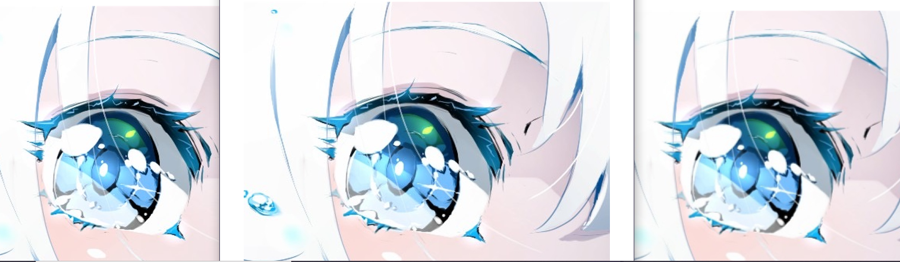
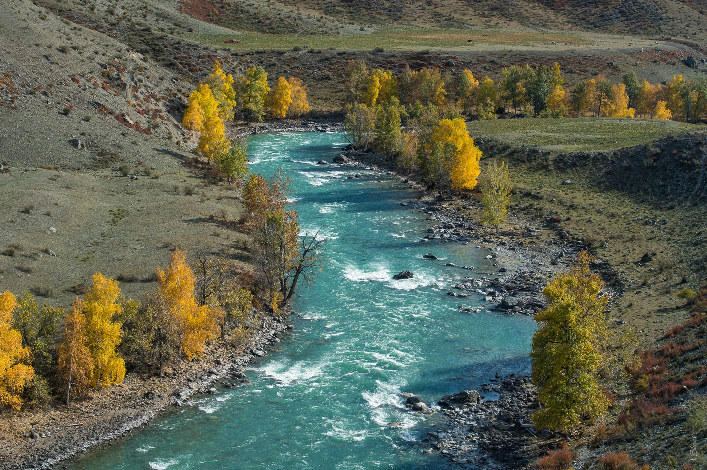
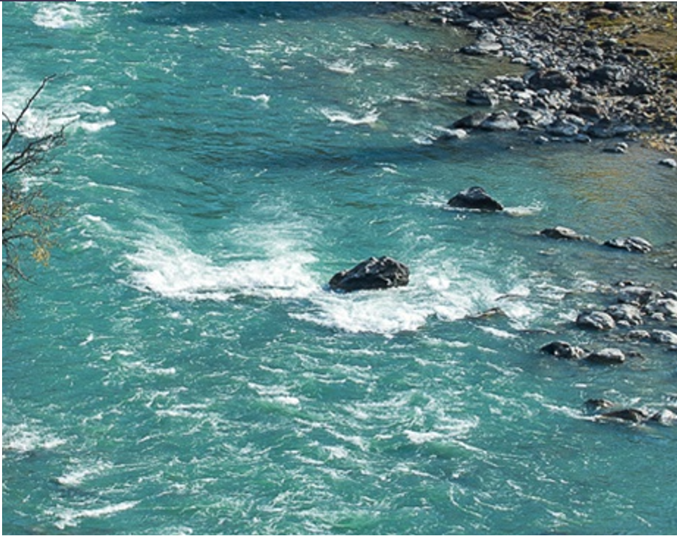
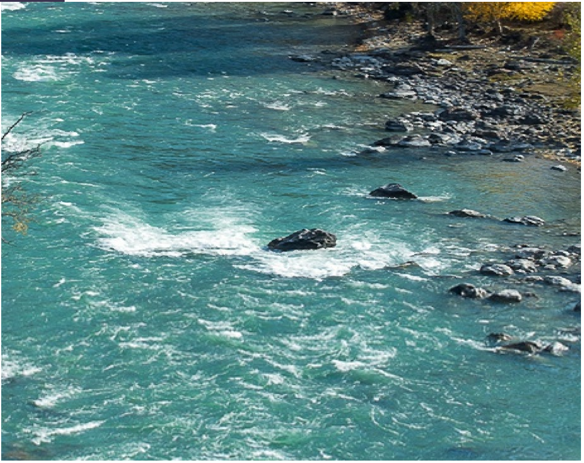
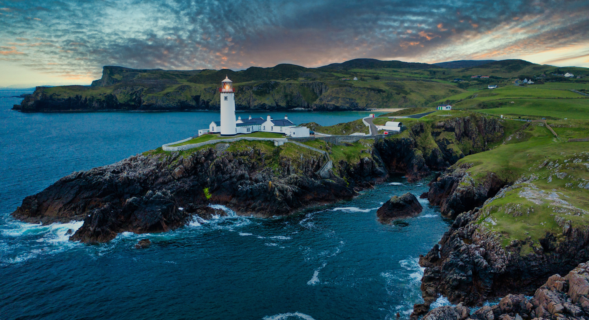
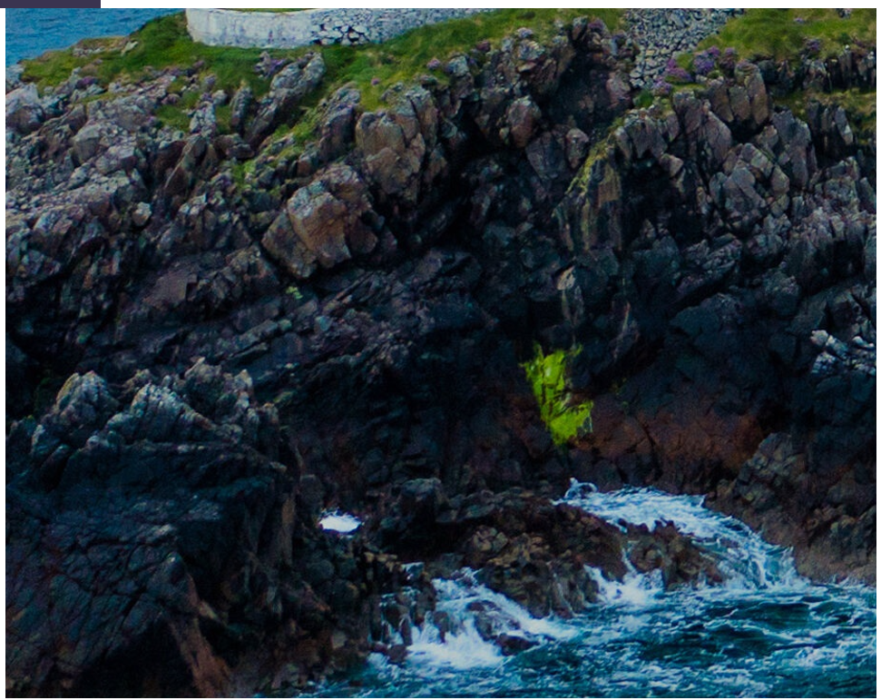
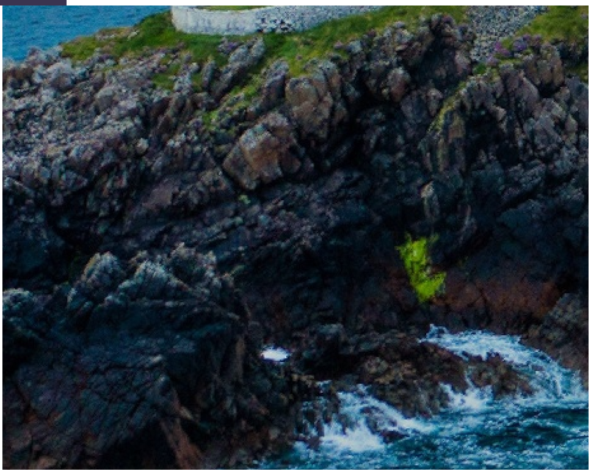
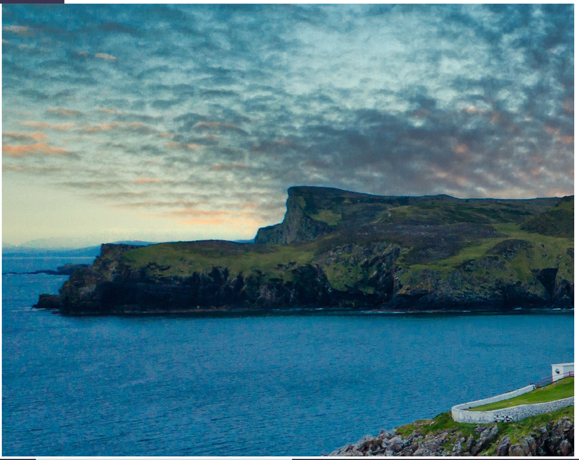
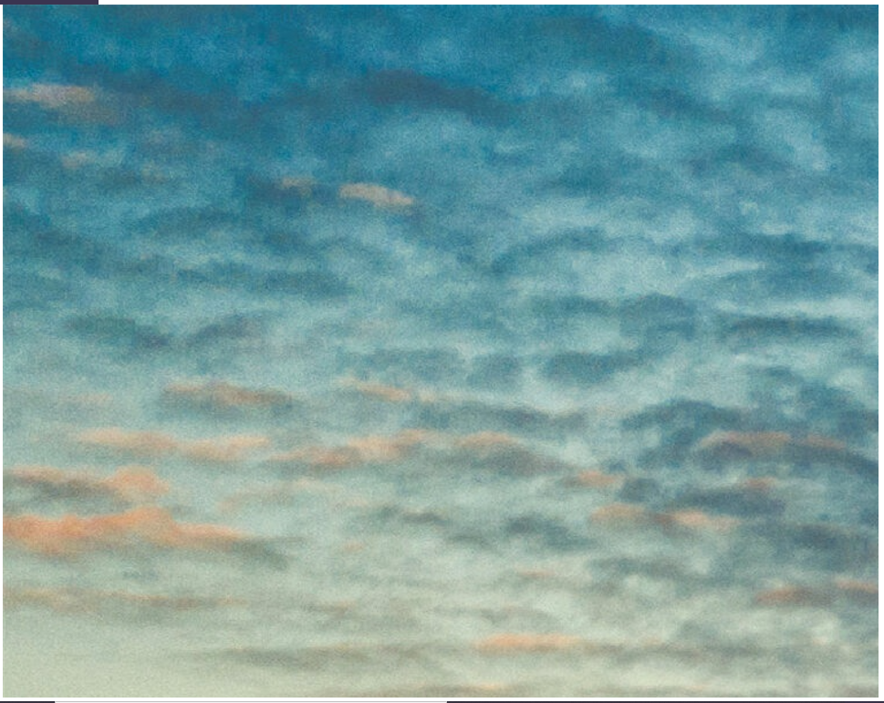
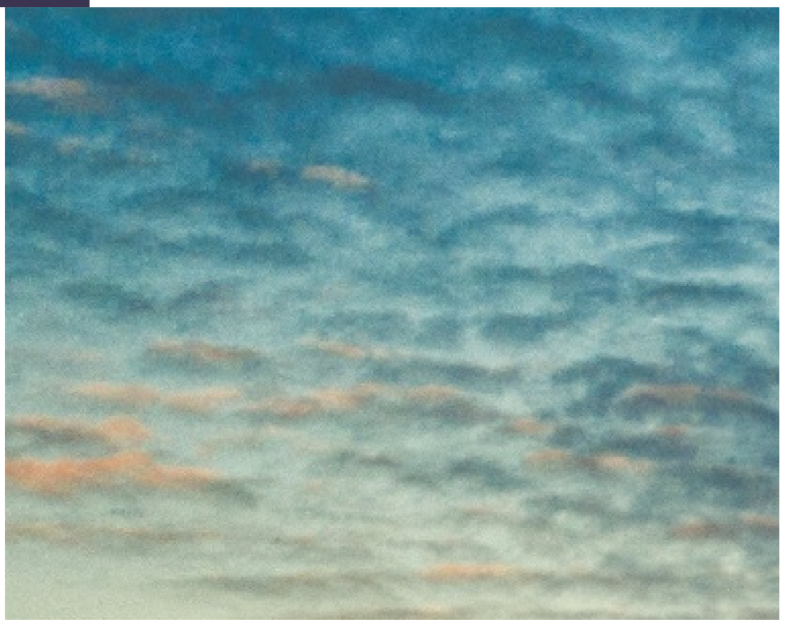

# -# 基于图像像素能量的等比例图像缩放算法

## 一、算法思路

### 1、对现有算法的分析

传统的图像缩放算法是通过各种规则建立原图像和目标图像像素的映射，包括以下几种：

1）最近邻算法，即寻找原图像同比例下距离目标像素最近的点。

2）插值算法，通过插值寻找图像像素函数在目效像素的值。

3）最近像素区域加权求和。对距离目标像素最近的所有像素，根据像素值加权求和。

传统算法往往基于像素的距离，像素相似度等，运算简单的算法往往效果较差。有些在放大过程中会出现模糊，马赛克等，缩小则会严重失真。

而部分算法会重新计算所有像素值，导致图像原本信息丢失，图像的对比度，灰度都被破坏。

seamcarving算法不是常规的图像缩放算法

在操作过程中，图像主要物体和背景的比例被破坏。进行缩小操作时，图像背景信息大量丢失，进行放大操作时，图像背景大量复制，主要物体不变。

### 2、算法具体实现思路及各操作效果对比

基于图像像素能量，等比例缩放图像。

像素能量是体现图像像素重要程度的重要衡量标准。

先考虑横向缩小算法：

1）为了保留尽可能多的图像信息，要尽可能使用原图像的像素。

2）算法目标为去除多于像素，保留剩余像素。

3）根据需要去除的横向像素，将图片分为几个区域。

3）计算图片的能量图，根据能量图寻找各区域能量最低的路径并删除。

4）计算路径的能量值时，根据像素点的纵向距离，设置一定的惩罚值，距离越远，惩罚值越高。

如果不设置惩罚值（即各区域取每行最低能量值的点作为去除像素），在缩小时对锐利边缘保留效果较差，会出现明显锯齿。如下图

如果仅允许每个像素变化0到1个横坐标，则对边缘的保留效果较差。在颜色变化大的图像中，边缘容易出现锯齿。

对于放大算法：

与缩小算法类似，找到能量最低路径后，在相邻的位置复制该路径。

如果新像素路径取能量最低路径与邻近位置平均后的值，图像整体的对比度会降低，即图像看起来色彩不鲜艳。（左下为原图768×509，中间为直接复制，右边为取平均值。中间和右边的图像为采用本算法放大后的图像，大小为1500×1000）放大观察，虽然图像颜色过渡更自然，但边缘会变得模糊。边缘的弧度也容易被破坏。

### 3、算法流程

#### 对于横向缩小：

1、根据缩小时需要裁剪的像素数量，将原图横向分为数个不同区域。

2、计算原图像的能量图

3、对图像能量图的每个区域，使用dp计算能量最低路径，根据路径相邻两个像素的横向距离，为路径加一个惩罚值，在源代码中，使用的惩罚值为8的x次方，x为两个像素横向距离。

4、删去每个区域能量最低路径的所有像素，得到目标图像。

#### 对于横向放大：

1~3步相同，第4步为复制路径的所有像素。

#### 对于纵向缩小：

先将图像进行转置，得到目标图像之后再转置，得到最终图像。

#### 对于横向缩小：

思路同上。

### 4、函数说明

#### Mat energy_(Mat image)

输入原图像，返回该图像的能量图

#### Mat search_x_path(Mat energy_map, int object_x)

输入能量图和缩放的高，返回用于缩放的矩阵carver_image.

#### Mat enlarge_x(Mat image, Mat carver_image, int object_x)

输入原图像和用于缩放的矩阵carver_image以及缩放的高，返回结果图像

#### Mat search_y_path(Mat energy_map, int object_y)

输入能量图和缩放的宽，返回用于缩放的矩阵carver_image.

#### Mat enlarge_y(Mat image, Mat carver_image, int object_y)

输入原图像和用于缩放的矩阵carver_image以及缩放的宽，返回结果图像

#### Mat scale(string filepath,string new_file_name, int object_x, int object_y)

输入原图像路径和输出图像路径以及缩放后图像的高和宽，返回缩放后图像。

## 二、实验效果

对于一个1920×1080的图片（上面第一张图），将其放大为3840×2160  对比观察其细节。（左图为原图放大167%后截取中心区域）。可以看到，虽然放大后的图片比例发生变化，但是对于图像的各种细节，都有很好的保留。如河流中心石块，波浪，和河岸附近的石块，他们仅发生了对于比例的缩放，各种细节并没有损失。

对5120×2788的图片缩小至原来一半并放大两倍，生成与原图像相同大小的图片，作为算法的效果评估。

（两图缩放比例为83%）可以看到，由于缩小时丢失了图像75%的信息，对于太过复杂的的细节，比如碎石，石墙纹理，海浪纹路细节等有所丢失。但海浪形状，石块表面的明显纹路不但位置正确，也有很好的边缘和颜色保留。

上两图为原图和新图缩放42%，下图为原图大小无缩放，截屏获得。可以看到，对于大块的色彩，采用本文所述算法，即使缩小时失去75%的图片信息，在放大后，图片依然有很好的效果，人眼很难看出差别。

## 三、算法的主要应用领域

该算法可用于所有等比例缩放的应用场景。如在保留图片物体比例的情况下修改图片尺寸，同比例放大图片以完成增加图片清晰度的任务。

## 四、算法的未来改进方向

该算法是基于图像原本信息进行计算，图像放大后原图像的瑕疵也会放大，图像缩小则会出现部分边缘中断。未来将根据像素能量识别图片边缘，采用插值等算法计算边缘曲线。建立原图像和新图像边缘的映射，使用计算出的边缘曲线对新图进行边缘像素修正

